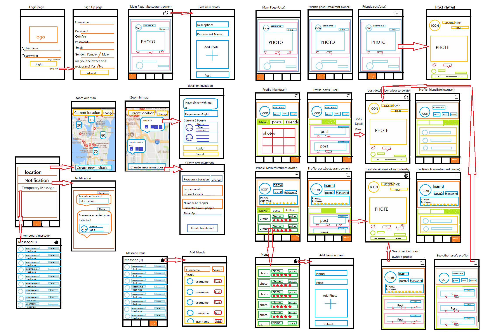

# FoodGram

## Table of Contents
1. [Overview](#Overview)
1. [Product Spec](#Product-Spec)
1. [Wireframes](#Wireframes)
2. [Schema](#Schema)

## Overview
### Description
Core: 
Individuals choose the food store they find awesome to follow and view the food store’s profile which includes food pictures, price, and comments. Individuals share their consumption experience in any kind of food store as the instagram-like posts. They can also see their friends' posts to decide which restaurants to try in the future.

Optional: 
When food lovers can't find friends or family members to try food with, they can locate themselves and search for people nearby. Send out an invitation, or join a team of people you're interested in, and try the food together

### App Evaluation

- **Category:** Social Networking / Food
- **Mobile:** This app would be primarily developed for mobile but would perhaps be just as viable on a computer, such as Instagram or other similar apps. Functionality wouldn’t be limited to mobile devices, however mobile version could potentially have more features.
- **Story:** Provide a platform of sharing food information from the users and the food stores.
- **Market:** Any individual could choose to use this app, and to keep it a safe environment, people would be organized into age groups.
- **Habit:** This app could be used as often or un-often as the user wanted depending on how deep their social life is, and what exactly they’re looking for.
- **Scope:** Creating user interfaces, including page viewing the friends’ posts and the food store’s posts, then perhaps add the location feature.

## Product Spec

### 1. User Stories (Required and Optional)


**Required Must-have Stories**

* Users sign up as a normal user or a food store （Two types of user）.
- [x] Normal User logs in to access friend list, previous chats, and list of following food stores.
* Normal User follow what they are interested in.
* Users who are friends have a chat window to communicate.
* Each normal user has a profile page which shows the posts submitted. Friends can thums up or add comments on each post.
* Each normal user can view the profile of the food store that they followed.
* Food store users log in to edit their profiles, such as edit the food pictures, prices, etc.
* Settings (Accesibility, Notification, General, etc.)

**Optional Nice-to-have Stories**

* The background basically is a map (like google map). And it is able to locate the user’s own position
* Users are able to create an invitation or see the current existing invitation on the map. (An invitation is to create a team to have food together)
    * When creating the invitation, the user has to set up the number of people to join, some words to say on invitation, and the place of the restaurant. 
    * These invitations will appear on the map as a small icon. The icon will contain the words the creator wrote, and the headshot of users who are currently on the team. 
* When a user tries to join a team, they click the small icon on the map to apply.
* When a user clicks the small icon on the map, a new intent appears. In this new intent:
    * The user can see the details of the invitation information:
    * The information of the users who are currently in the team. Such the their username, headshot photo, gender, age, etc
    * The words that the creator worte.
    * Two buttons: Apply and Cancel. 
* The invitation creator is able to cancel or start the team meeting. 
    * Starting the team meeting, the system will add all people on the team to a group chat.

### 2. Screen Archetypes

**All Users:**
- [x] Login
* Register - User signs up or logs into their account
   * Upon Download/Reopening of the application, the user is prompted to log in to gain access to their profile information to be properly matched with another person.
   * Users will choose to sign up as normal users or food store users.
* Settings Screen
    * Lets people change language, and app notification settings.
    
    
**Normal Users:**
* Normal User main page (view followed food store posts)
   * Show followed food store posts chronologically. 
   * Each post has the user’s headshot, food picture, created time and some words.
   * Click each post to see the details which include larger pictures, comments.
* Normal User second page (view friend's posts)
   * Show all friend’s posts chronologically. 
   * Each post has the user’s headshot, food picture, and some words.
   * Click each post to see the details which include larger pictures, comments.
   * Tap on top right corner of menu bar allow user to create a new post
* Users third page(optional)
   * Showing a list of contents, includes:
        *  Find location
        *  Notification
        *  Temporary Message
* Normal User fourth page
   * Show the list of friends, in a recyclerview
   * Each item in recyclerview contains the user’s headshot, username, and the last message sent.
   * Items are ordered chronologically.
   * On the top bar of the page, shows the number of unread messages. 
* Normal User fifth page (User’s own profile)
    * Shows the user’s headshot icon and username, total number of posts made, number of food stores followed, and number of friends added.
    * Show a grid view of the most recent nine photos
    * Show all posts from the past in recyclerview contain posted time, description.Tap on these posts to show a detailed view.
    * Show friends and followed list


**Food Store Users:**
* Food Store User main page (view followed food store posts)
    * Show followed food store posts chronologically. 
    * Each post has the user’s headshot, food picture, created time and some words.
    * Click each post to see the details which include larger pictures, comments.
    * Tap on top right corner of menu bar allow food store user to create a new post
* Food Store User second page (view friend's posts)
    * Show all friend’s posts chronologically. 
    * Each post has the user’s headshot, food picture, and some words.
    * Click each post to see the details which include larger pictures, comments.
* Food Store User third page
    * Show the list of friends, in a recyclerview
    * Each item in recyclerview contains the user’s headshot, username, and the last message sent.
    * Items are ordered chronologically.
    * On the top bar of the page, shows the number of unread messages.
*  Food Store User fourth page (own profile)
    * Shows the user’s headshot icon and username, total number of posts made, number of followers, and number of friends added.
    * Show menu in recyclerview contains food image, food name, price
    * Show all posts from the past in recyclerview contain posted time, description. Tap on these posts to show a detailed view.
    * Show friends and followed list

### 3. Navigation

**Tab Navigation** (Tab to Screen)

* Food Store post page
* Friends' posts page
* Message page
* Profile
* Music selection
* Settings

Optional:
* Music/Encounter Queue
* Discover (Top Choices)

**Flow Navigation** (Screen to Screen)

* Forced Log-in
   * Account creation if no login is available
* Music Selection (Or Queue if Optional)
   * Jumps to Chat
* Profile
   * Text field to be modified.
* Settings Toggle settings

**Addition**
* User can pull to refresh the posts in all pages (except for the menu displayed on the Food Store users’ profile)
* Only the post created by Food Store users is allowed forward by other users. 
* Tap on posts will display the detail view
* All users are only allow to delete their own posts in their own profile page
* Screen will stay on the current post's position after the user tap a post to view post details.


## Wireframes


### [BONUS] Digital Wireframes & Mockups

### [BONUS] Interactive Prototype

## Schema 
### Models

####  User
| Property      | Type     | Description |
   | ------------- | -------- | ------------|
   | objectId      | String            | unique id for the each  normal user
   | type          | String            | Indicate user type|
   | username      | String            | username for login|
   | password      | String            | password for login
   | icon          | File              | icon of the user |
   | email         | String            | email of user |
   | storeAddress  | String            | address of food store |
   | phoneNum      | String            | phone number of food store |
   | rating        | Number            | rating of food store|
   | createdAt     | DateTime          | date when user account is create (default field) |

  
#### UserPosts

   | Property      | Type     | Description |
   | ------------- | -------- | ------------|
   | objectId      | String            | unique id for the user post (default field) |
   | author        | Pointer to User   | post's author |
   | image         | File              | image that user posts |
   | description   | String            | description add to each post |
   | commentsCount | Number            | number of comments that has been posted to an image |
   | likesCount    | Number            | number of likes for the post |
   | createdAt     | DateTime          | date when post is created (default field) |
   | updatedAt     | DateTime          | date when post is last updated (default field) |
   
#### FoodStorePost

   | Property      | Type     | Description |
   | ------------- | -------- | ------------|
   | objectId      | String            | unique id for the user post (default field) |
   | author        | Pointer to User   | post's author |
   | image         | File              | image that user posts |
   | description   | String            | description add to each post |
   | commentsCount | Number            | number of comments that has been posted to an image |
   | likesCount    | Number            | number of likes for the post |
   | shareCount    | Number            | number of times each post have been share |
   | createdAt     | DateTime          | date when post is created (default field) |
   | updatedAt     | DateTime          | date when post is last updated (default field) |

#### FoodStoreMenu

   | Property      | Type     | Description |
   | ------------- | -------- | ------------|
   | objectId      | String            | unique id for the menu (default field) |
   | store         | Point to User     | menu's store |
   | foodImage     | File              | food image in menu |
   | foodName      | String            | name of the food |
   | price         | Number            | price of the food |
   | createdAt     | DateTime          | date when a food is add to menu(default field) |
   | updatedAt     | DateTime          | date when menu is last updated (default field) |
 
#### Rating

   | Property      | Type     | Description |
   | ------------- | -------- | ------------|
   | objectId      | String            | unique id for the menu (default field) |
   | username      | Point to User     | user who is rating |
   | FoodStore     | Point to User     | food store |
   | rating        | Number            | rating number provide by user|
   | createdAt     | DateTime          | date when a food is add to menu(default field) |
   | updatedAt     | DateTime          | date when menu is last updated (default field) |
   
#### FriendRequest
| Property      | Type     | Description |
   | ------------- | -------- | ------------|
   | objectId      | String            | unique id for the each friend request
   | senderUsername| Point to User     | username for sender|
   | receiverUsername| Point to User   | username for receiver|
   | createdAt     | DateTime          | date when friend request is create (default field) |
   | status        | Number            | Indicate whether a friend request is in progress/accepted/decline |
   
#### Follow
| Property      | Type     | Description |
   | ------------- | -------- | ------------|
   | objectId      | String            | unique id for the each follow|
   | Username      | Point to User     | username for follower|
   | followFoodStore| Point to User     | username for followed food store|
   | createdAt     | DateTime          | date when a store is followed by a user (default field) |

#### Chat

   | Property      | Type     | Description |
   | ------------- | -------- | ------------|
   | objectId      | String            | unique id for the  (default field) |
   | sender        | Point to User     | message sender|
   | receiver      | Point to User      | message receiver |
   | message       | String            | message sent |
   | createdAt     | DateTime          | date when message is sent(default field) |
   


**Optional stories models**
#### Dining invitation

   | Property      | Type     | Description |
   | ------------- | -------- | ------------|
   | objectId      | String            | unique id for the dinning invitation (default field) |
   | inviter       | Pointer to NormalUser| inviter of a dinning invitation|
   | description   | String            | description add in invertaion |
   | requirement   | String            | requirements in a dinning invitation |
   | inviterCount  | Number            | number of people in inviter side |
   | peopleCount   | Number            | number of people want to invite|
   | createdAt     | DateTime          | date when invitation is created (default field) |
   | status        | Number            | Indicate whether a invitation is in progress or completed|
   | accepter      | Pointer to NormalUser| accepter of a dinning invitation|
   

#### Notification

   | Property      | Type     | Description |
   | ------------- | -------- | ------------|
   | objectId      | String            | unique id for each notification (default field) |
   | receiver      | Point to NormalUser| notification receiver |
   | detail        | String            | notification detail |
   | crearedAt     | DateTime          | date when notification is created(default field) |

### Networking
#### List of network requests by screen

**Normal Users:**

   - Normal User main page
      - (Read/GET) Query all followed food store posts 
         ```swift
         let query = PFQuery(className:"FoodStorePost")
         query.whereKey("author", in follower)
         query.order(byDescending: "createdAt")
         query.findObjectsInBackground { (posts: [PFObject]?, error: Error?) in
            if let error = error { 
               print(error.localizedDescription)
            } else if let posts = posts {
               print("Successfully retrieved \(posts.count) posts.")
           // TODO: Do something with posts...
            }
         }
         ```
     - (Create/POST) Create a new like on a post
     - (Delete) Delete existing like
     - (Create/POST) Create a new comment on a post
     - (Delete) Delete existing comment 


   - Normal User second Screen
      - (Read/GET) Query all friend’s posts 
         ```swift
         let query = PFQuery(className:"friends_posts")
         query.whereKey("author", in friend)
         query.order(byDescending: "createdAt")
         query.findObjectsInBackground { (posts: [PFObject]?, error: Error?) in
            if let error = error { 
               print(error.localizedDescription)
            } else if let posts = posts {
               print("Successfully retrieved \(posts.count) posts.")
           // TODO: Do something with posts...
            }
         }
         ```
     - (Create/POST) Create a new post object
     - (Create/POST) Create a new like on a post
     - (Delete) Delete existing like
     - (Create/POST) Create a new comment on a post
     - (Delete) Delete existing comment

   - Normal User thrid Screen (optional stoies)
     - (Create/POST) Create a new invatation
     - (Delete) Delete existing invation
     - (Update/PUT) Update when other user accepted invitation
   
   
   
   - Normal User fourth Screen
     - (Read/GET) Query all text message where reciever is currentUser
         ```swift
         let query = PFQuery(className:"Chats")
         query.whereKey("reciever", equalTo: currentUser)
         query.whereKey("sender", in friend)
         query.order(byDescending: "createdAt")
         query.findObjectsInBackground { (messages: [PFObject]?, error: Error?) in
            if let error = error { 
               print(error.localizedDescription)
            } else {
               print("Successfully retrieved \(messages.count) messages.")
           // TODO: Do something with messages...
            }
         }
        ```
     - (Create/POST) Create a new Chat with user in friendlist
     - (Delete) Delete existing chat

     
     
 - Normal User fifth Screen
     - (Read/GET) Query all users in friend list of current user
         ```swift
         let query = PFQuery(className:"FriendRequest")
         query.whereKey("senderUsername" or "receiverUsername", equalTo: currentUser)
        // status: 0 = pending, 1 = accepted, 2= decline
         query.whereKey("status" , equalTo:  1)
         query.order(byDescending: "createdAt")
         query.findObjectsInBackground { (friends: [FRObject]?, error: Error?) in
            if let error = error { 
               print(error.localizedDescription)
            } else {
               print("Successfully retrieved \(friends.count) friends.")
           // TODO: Do something with friends...
            }
         }
        ```
        
    - (Read/GET) Query all posts created by currentUser
        ```swift
         let query = PFQuery(className:"NormalUserPost")
         query.whereKey("author", equalTo: currentUser)
         query.order(byDescending: "createdAt")
         query.findObjectsInBackground { (posts: [PFObject]?, error: Error?) in
            if let error = error { 
               print(error.localizedDescription)
            } else if let posts = posts {
               print("Successfully retrieved \(posts.count) posts.")
           // TODO: Do something with posts...
            }
         }
        ```         
    * (Create/POST) Create a new like on a post
    * (Delete) Delete existing like
    * (Delete) Delete existing comment
    * (Delete) Delete existing posts
    * (Update/PUT) Update user profile image
    * (Create/POST) Create a new comment on a post

**Food Store Users:**

   - Food Store User main page
      - (Read/GET) Query all followed food store posts 
         ```swift
         let query = PFQuery(className:"FoodStorePost")
         query.whereKey("author", in follower)
         query.order(byDescending: "createdAt")
         query.findObjectsInBackground { (posts: [PFObject]?, error: Error?) in
            if let error = error { 
               print(error.localizedDescription)
            } else if let posts = posts {
               print("Successfully retrieved \(posts.count) posts.")
           // TODO: Do something with posts...
            }
         }
         ```
     - (Create/POST) Create a new post object
     - (Create/POST) Create a new like on a post
     - (Delete) Delete existing like
     - (Create/POST) Create a new comment on a post
     - (Delete) Delete existing comment 

   - Food Store User second Screen
      - (Read/GET) Query all friend’s posts 
         ```swift
         let query = PFQuery(className:"friends_posts")
         query.whereKey("author", in friend)
         query.order(byDescending: "createdAt")
         query.findObjectsInBackground { (posts: [PFObject]?, error: Error?) in
            if let error = error { 
               print(error.localizedDescription)
            } else if let posts = posts {
               print("Successfully retrieved \(posts.count) posts.")
           // TODO: Do something with posts...
            }
         }
         ```
     - (Create/POST) Create a new like on a post
     - (Delete) Delete existing like
     - (Create/POST) Create a new comment on a post
     - (Delete) Delete existing comment

  
   
   - Food Store User third Screen
     - (Read/GET) Query all text message where reciever is currentUser
         ```swift
         let query = PFQuery(className:"Chats")
         query.whereKey("reciever", equalTo: currentUser)
         query.whereKey("sender", in friend)
         query.order(byDescending: "createdAt")
         query.findObjectsInBackground { (messages: [PFObject]?, error: Error?) in
            if let error = error { 
               print(error.localizedDescription)
            } else {
               print("Successfully retrieved \(messages.count) messages.")
           // TODO: Do something with messages...
            }
         }
        ```
     - (Create/POST) Create a new Chat with user in friendlist
     - (Delete) Delete existing chat

     
     
 - Food Store User fourth Screen
     - (Read/GET) Query list of menu of current food store
         ```swift
         let query = PFQuery(className:"FoodStoreMenu")
         query.whereKey("store", equalTo: currentFoodStore)
        // status: 0 = pending, 1 = accepted, 2= decline
         query.order(byDescending: "createdAt")
         query.findObjectsInBackground { (menu: [Object]?, error: Error?) in
            if let error = error { 
               print(error.localizedDescription)
            } else {
               print("Successfully retrieved \(menu.count) menu.")
           // TODO: Do something with menu
            }
         }
        ```
        
    - (Read/GET) Query all posts created by currentUser
        ```swift
         let query = PFQuery(className:"NormalUserPost")
         query.whereKey("author", equalTo: currentUser)
         query.order(byDescending: "createdAt")
         query.findObjectsInBackground { (posts: [PFObject]?, error: Error?) in
            if let error = error { 
               print(error.localizedDescription)
            } else if let posts = posts {
               print("Successfully retrieved \(posts.count) posts.")
           // TODO: Do something with posts...
            }
         }
        ```  
    * (Create/POST) Create a new like on a post
    * (Delete) Delete existing like
    * (Delete) Delete existing comment
    * (Delete) Delete existing posts
    * (Update/PUT) Update user profile image
    * (Create/POST) Create a new comment on a post
    
    
      
#### [OPTIONAL:] Existing API Endpoints
##### first API
- Base URL - [api url]()

   HTTP Verb | Endpoint | Description
   ----------|----------|------------
    `GET`    | 
    `GET`    | 
